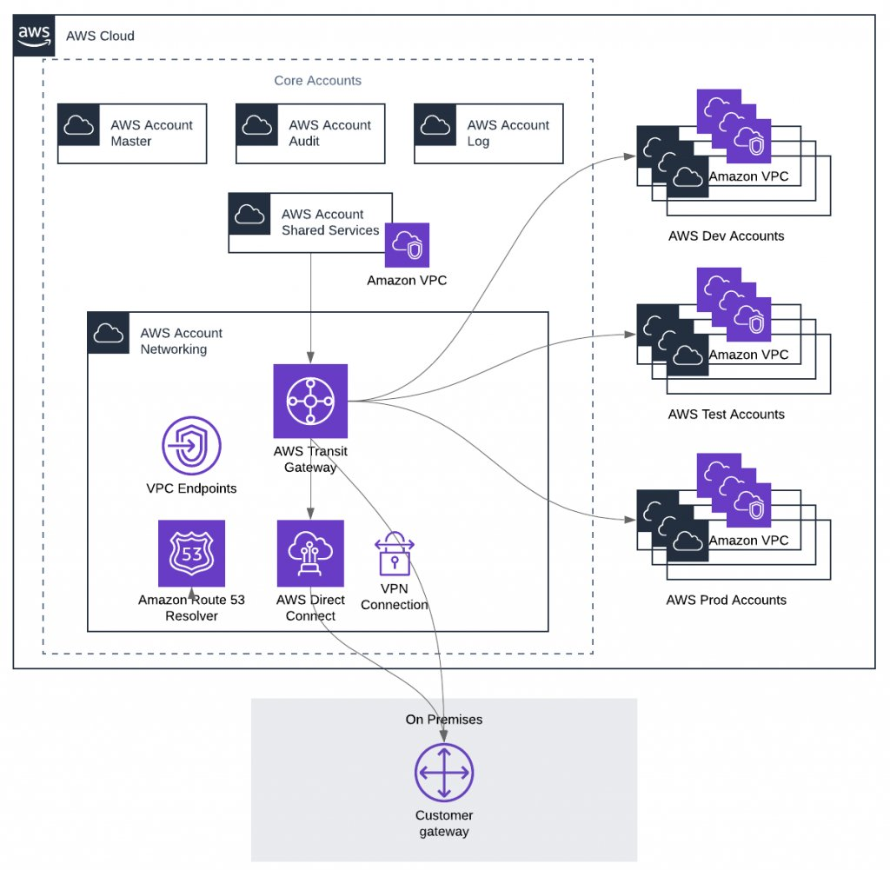

# AWS Arch
[diag-0001](https://aws.amazon.com/blogs/architecture/the-journey-to-cloud-networking/)

---
[diag-0002](http://www.netdesignarena.com/index.php/2020/04/15/new-blog-series-aws-cloud-networking-zero-to-hero/)

---

    
Gartner 2019 ML report

    [Gartner 2019 ML Report](https://github.com/shakkathir/AWSArch/tree/master/2020/2019.feb.gartner.ML.AI.DS.2020.REPORT.pdf)

