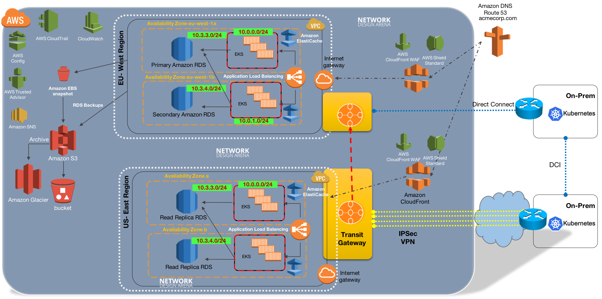

# AWS Arch
[diag-0001](https://aws.amazon.com/blogs/architecture/the-journey-to-cloud-networking/)

---
[diag-0002](http://www.netdesignarena.com/index.php/2020/04/15/new-blog-series-aws-cloud-networking-zero-to-hero/)

---
[Gartner 2019 ML Report](https://github.com/shakkathir/AWSArch/tree/master/2020/2019.feb.gartner.ML.AI.DS.2020.REPORT.pdf)

Markup : 

           
Title 1

           
Content 1 Content 1 Content 1 Content 1 Content 1

         

         
<object data="https://github.com/shakkathir/AWSArch/tree/master/2020/2019.feb.gartner.ML.AI.DS.2020.REPORT.pdf" type="application/pdf" width="700px" height="700px">
    <embed src="https://github.com/shakkathir/AWSArch/tree/master/2020/2019.feb.gartner.ML.AI.DS.2020.REPORT.pdf">
        
This browser does not support PDFs. Please download the PDF to view it: <a href="https://github.com/shakkathir/AWSArch/tree/master/2020/2019.feb.gartner.ML.AI.DS.2020.REPORT.pdf">Download PDF</a>.

    </embed>
</object>