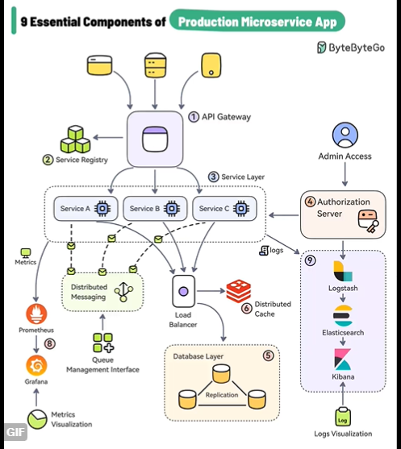
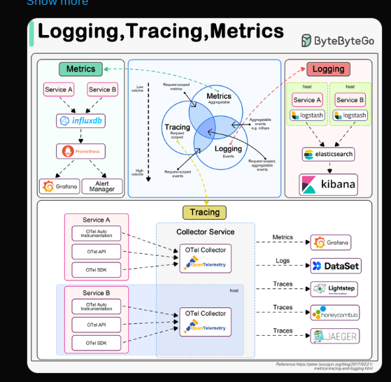

- [Microservices](#twitter-alex)
- [APIGateway](#api-gateway-vs-load-balancing)
- [ECS vs Eks](#ecs-vs-eks)
- [logging](#logging-tracking-and-metrics)

> <mark>Fri 07/19/2024
#### Twitter Alex  
[9 Essential Components of a Production <mark>Microservice</mark> Application](https://x.com/i/status/1813581409463988469)

### API Gateway Vs Load balancing.  
* API Gateway  
  * Authentication + Validation
  * Security 
  * Ratelimiting
  * Logging 
  * Transformation.

* Load Balancing (ELB)
    * Distributes the load to the back end.

### ECS vs EKS

- [ECS vs EKS Usecase](https://www.nops.io/blog/aws-eks-vs-ecs-the-ultimate-guide/#:~:text=ecs%20vs%20eks%20use%20cases)

- [ECS vs EKS](https://www.nops.io/blog/aws-eks-vs-ecs-the-ultimate-guide/#:~:text=potentially%20lower%20with%20fargate%2C%20depending%20on%20usage%20patterns)  

- [ECS vs EKS](https://www.eginnovations.com/blog/top-10-aws-services-explained-with-use-cases/#5_AWS_ECS_-_Elastic_Container_Service:~:text=with%20amazon%20ecs%2C%20you%20don%E2%80%99t%20have%20to%20operate%20your%20own%20cluster%20management%20and%20configuration%20management%20systems)

### Logging, Tracking and Metrics 
[logging](https://x.com/sahnlam/status/1811282066161684623)  

Perfection is not great thing.  
  
[link](https://x.com/ScholarshipfPhd/status/1814029790849999164)  
> e. <mark>Fri 07/19/2024

