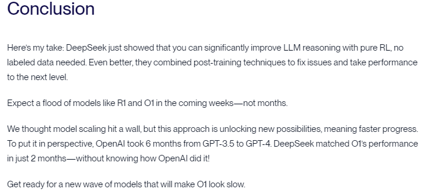

## 2024-01-28-Tue
1. DeepSeek Notes.   

    1. Source Page : https://www.linkedin.com/pulse/deepseek-dummies-heres-what-you-need-know-ais-latest-schiessl-rdaue)  

        **DeepSeekMoE** (Mixture of Experts): Instead of activating the entire model for every task, DeepSeekMoE used a network of specialized and general-purpose “experts,” activating only the relevant ones. This innovation reduced computational waste and improved performance.  

        1. https://www.linkedin.com/pulse/deepseek-dummies-heres-what-you-need-know-ais-latest-schiessl-rdaue#:~:text=two%20groundbreaking%20technologies%3A-,deepseekmoe%20,-(Mixture%20of%20Experts)

        **DeepSeekMLA** (Multi-head Latent Attention): A solution to the heavy memory demands of inference. By compressing key-value storage, DeepSeek reduced memory usage significantly, making large-scale inference more efficient.   

        1. https://www.linkedin.com/pulse/deepseek-dummies-heres-what-you-need-know-ais-latest-schiessl-rdaue#:~:text=multi-head%20latent%20attention

        Models are teaching themselves and other models, accelerating advancements and potentially paving the way toward AGI.

        1. https://www.linkedin.com/pulse/deepseek-dummies-heres-what-you-need-know-ais-latest-schiessl-rdaue#:~:text=models%20are%20teaching%20themselves

    1. Source Page : https://www.vellum.ai/blog/the-training-of-deepseek-r1-and-ways-to-use-it
    
        **DeepSeek just made a breakthrough**: you can train a model to match OpenAI o1-level reasoning using pure reinforcement learning (RL) without using labeled data (DeepSeek-R1-Zero). But RL alone isn’t perfect — it can lead to challenges like poor readability. A mix of methods in a multi-stage training fixes these (DeepSeek-R1).

        These **"reasoning models" introduce a chain-of-thought (CoT) thinking phase before generating an answer at inference time**, which in turn improves their reasoning performance.

        To better understand the backbone of DeepSeek-R1, let's cover the basics:
        1. https://www.vellum.ai/blog/the-training-of-deepseek-r1-and-ways-to-use-it#:~:text=to%20better%20understand%20the%20backbone%20of%20deepseek

        

        